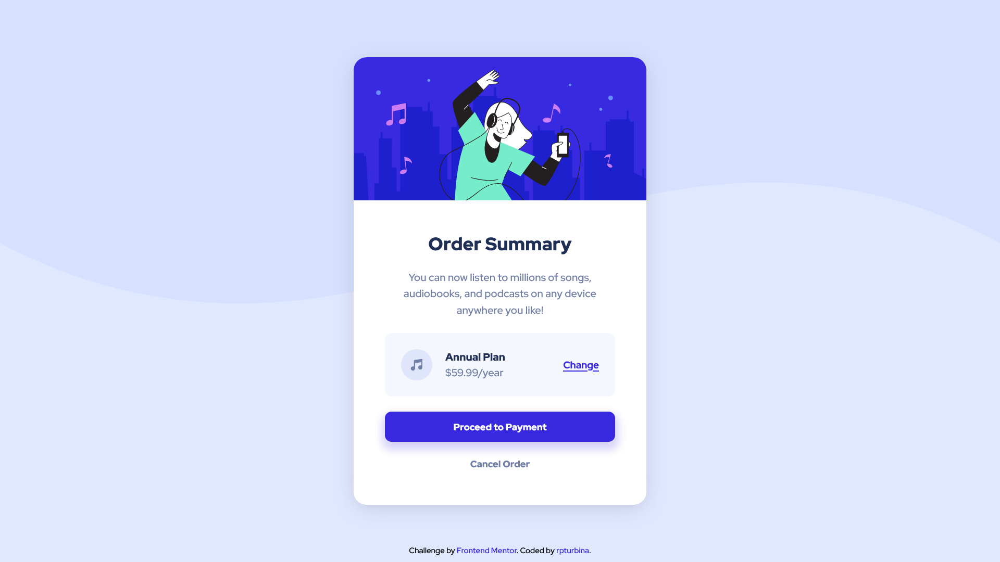

# Frontend Mentor - Order summary card solution

This is a solution to the [Order summary card challenge on Frontend Mentor](https://www.frontendmentor.io/challenges/order-summary-component-QlPmajDUj). Frontend Mentor challenges help you improve your coding skills by building realistic projects.

## Table of contents

- [Overview](#overview)
  - [The challenge](#the-challenge)
  - [Screenshot](#screenshot)
  - [Links](#links)
- [My process](#my-process)
  - [Built with](#built-with)
  - [What I learned](#what-i-learned)
  - [Continued development](#continued-development)
  - [Useful resources](#useful-resources)
- [Author](#author)
- [Acknowledgments](#acknowledgments)

## Overview

### The challenge

Users should be able to:

- See hover states for interactive elements

### Screenshot



### Links

- Solution URL: [Solution Repo](https://github.com/rpturbina/order-summary-component-main)
- Live Site URL: [Live Demo](https://rpturbina.github.io/order-summary-component-main/)

## My process

### Built with

- Semantic HTML5 markup
- [SASS](https://sass-lang.com/) (SCSS) - For styles
- Flexbox
- Mobile-first workflow

### What I learned

I have learned how to use SASS as CSS preprocessor using SCSS syntax. Spesifically, in this project i'm learning to use SASS Variables and Nesting. Just the basics by the way.

Below I include an example code about SASS variables and nesting.

```html
<main class="main">
  <h1 class="main__title">Hello, rpturbina! Welcome back to your learning journey!</h1>
</main>
```

```scss
// * Using SCSS Syntax
// * SASS Variables
$bg-color: hsl(225, 100%, 94%);
$text-color: hsl(223, 47%, 23%);

// * How to use declared SASS Variables
.main {
  background-color: $bg-color;

  // * How to use nesting feature in SASS
  h1 {
    font-size: 16px;
  }

  &__title { // * "&" represent ".main"
    color: $text-color;
  }

}
```

The SCSS syntax above if compiled by using css preprocessor to CSS syntax (in this case using **SASS**) will be like below,

```css
.main {
  background-color: hsl(225, 100%, 94%);
}

.main h1 {
  font-size: 16px;
}

.main__title {
  color: hsl(223, 47%, 23%);
}

```

### Continued development

Going forward, I still need to learn about SASS and how to implement it into my future projects in order to develop large-scale projects and make them easy to scale and easy to manage. I will learn another useful features from SASS.

### Useful resources

- [SASS Guide](https://sass-lang.com/guide) - This helped me for understanding about basics of SASS and how to use them.
- [SASS Video Tutorials (Indonesian)](https://www.youtube.com/playlist?list=PLFIM0718LjIUqemgG97MAOK0J_berlQM5) - These are very helpful video tutorial series about SASS to understanding basics of them and how to use them. These videos was made by [Mr. Sandhika Galih](https://github.com/sandhikagalih) in his youtube channel, [Web Programming UNPAS](https://www.youtube.com/channel/UCkXmLjEr95LVtGuIm3l2dPg).

## Author

- Website - [rpturbina.github.io](https://rpturbina.github.io)
- Frontend Mentor - [@rpturbina](https://www.frontendmentor.io/profile/rpturbina)
